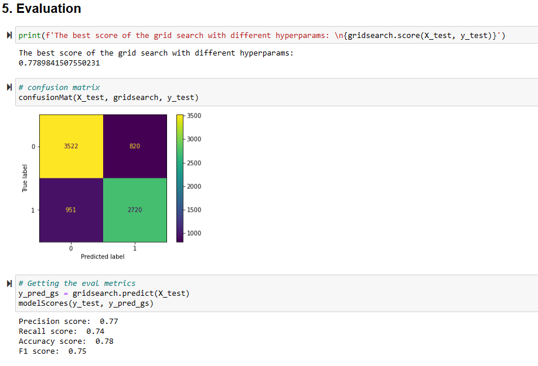

# Phase_3_Project

## Elements in Repo

## Links to presentation and source of data
* The presentation content is: 
* The data stores are located in: 
* Images on the presentation and readme file are located in:

## Project Summary
This Project is an attempt at creating a Machine Learning model to assist in the prediction of seasonal flu vaccine adminstration on individual based on uinque features represent such individuals

### 1. Business Understanding:
#### Premise:
- As the world struggles to vaccinate the global population against COVID-19, an understanding of how people’s backgrounds, opinions, and health behaviors are related to their personal vaccination patterns can provide guidance for future public health efforts. Your audience could be someone guiding those public health efforts.

#### Desired oucome:
- Creating of a model that can predict seasonal flu vaccined people and vice versa.

### 2. Data Understanding
- We have the understanding of the features (i.e. independent variables) and predictors (i.e. dependent variables)
- The data is a mix of categorical and numeric variables.

### 3. Data Preparation
- Choosing which target variable to go with. The end result is seasonal_vaccine because of its more balanced distribution of data which will prevent needing to result to oversampling and undersampling techniques in order to prevent a lot of bias in the disease detection which can lead to a lot of uncertaninity (i.e. underfitting)

- Dealing with missing values:

  * Removing the features with too much missing data, meaning, instead of removing rows from the dataset, potentially dropping potential learning points, it would be better to remove feaures where too much replacement of data could bring exreme error, especially in sensitive features (e.g race or gender, which didn't have any missing values)
  
  
 
 - Encoding the remaining categorical features:
 
 
 
 ### 4. Modeling & 5. Evaluation
 a. Logistic Regression
 
 
 b. Logistic Regression (With Tuned Hyperparams)
 
 

c. Decision Trees Classifier
 
 

d. Naive Bayes 
 
 

### 6. Conclusion
- Logistic Regression produced the highest ROC score, hence, should be used in the prediction of unseen features and will be a target to beat when potentially creating an ensemble model where the aggregated score should beat the current ROC score beacuse that will show how well a model can predict features it hasn't seen yet, not the accuracy, at least in this case where the data between the classes was well balanced.
